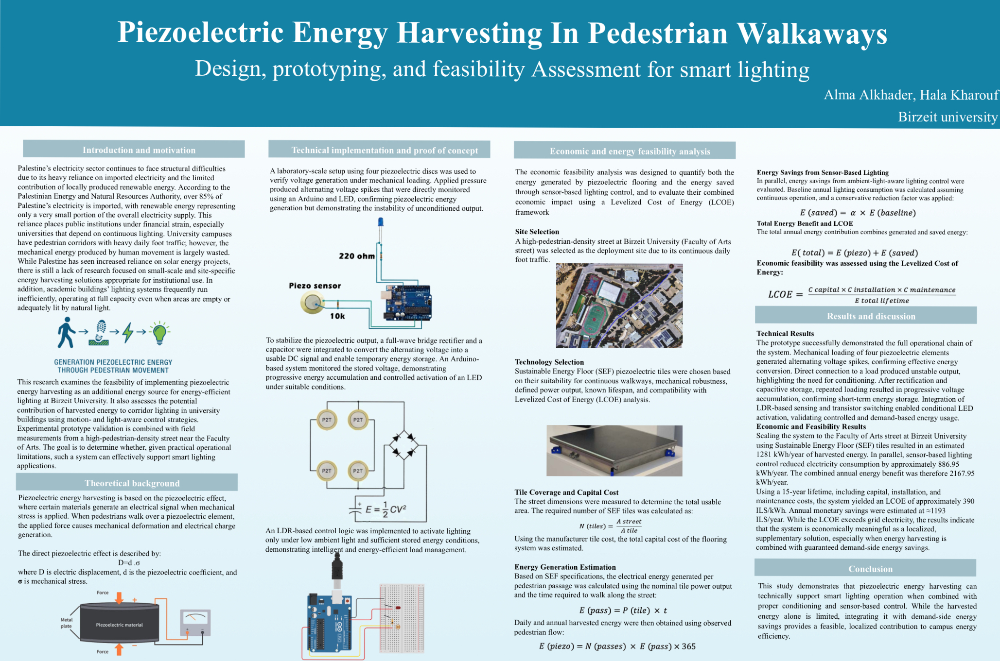

# Piezoelectric Energy Harvesting in Pedestrian Walkways

This repository documents the **hardware implementation and prototype validation**
of a piezoelectric energy harvesting system designed for pedestrian walkways.

The **theoretical background, feasibility study, economic analysis, and formal results**
are provided in the accompanying research paper located in the `paper/` directory.
This repository focuses strictly on **system architecture, circuit implementation,
and experimental behavior**.

---

## Project Scope

- Harvest mechanical energy from pedestrian footsteps using piezoelectric elements
- Demonstrate limitations of raw piezoelectric output
- Implement rectification and energy storage for output stabilization
- Integrate sensor-based lighting control to reduce energy consumption
- Validate system behavior through laboratory-scale prototypes

---

## System Overview

The system converts pedestrian-induced mechanical stress into electrical energy using
piezoelectric elements. The generated energy is conditioned and stored before being
used to support low-power lighting applications.

  

---
## Components Used and Their Roles

This project was implemented using two hardware configurations:
1. A **direct piezoelectric output circuit** (without rectification or storage)
2. A **conditioned energy harvesting circuit** (with rectification and capacitive storage)

The following components were used across the two configurations.

---

### 1. Piezoelectric Sensors (×4)

**Purpose**
- Convert mechanical stress from pedestrian footsteps into electrical energy.

**Configuration**
- Four piezoelectric discs were connected in a **series–parallel configuration**.

**Reason for configuration**
- Series connection increases output voltage.
- Parallel connection increases current capability.
- The combined configuration provides a better balance for energy harvesting than using a single element.

**Usage**
- Used in both prototype circuits (with and without rectification).

---

### 2. Resistors

#### a) 100 kΩ Resistor

**Purpose**
- Voltage stabilization and protection.
- Prevents excessive voltage from damaging Arduino input pins.

**Usage**
- Connected across the piezoelectric output when interfacing with the Arduino.
- Used primarily in the **direct piezo output prototype** to limit current during voltage spikes.

---

#### b) 10 kΩ Resistor

**Purpose**
- Pull-down / voltage reference resistor.

**Usage**
- Used with the piezoelectric sensor input to stabilize analog readings.
- Used with the LDR as part of a voltage divider for ambient light sensing.

---

#### c) 220 Ω Resistor
- Current-limiting resistor for the LED.
- Prevents excessive current from damaging the LED and Arduino output pins.
- Ensures safe and consistent LED operation in both prototypes.
---

### 3. Diodes (×4)

**Purpose**
- Construct a **full-wave bridge rectifier**.

**Why needed**
- Piezoelectric sensors generate an alternating (AC) voltage.
- Lighting systems and energy storage require direct current (DC).

**Usage**
- Used only in the **second prototype circuit**.
- Four diodes form a bridge rectifier that converts AC output from the piezo array into DC.

---

### 4. Capacitor

**Purpose**
- Energy storage and voltage smoothing.

**Why needed**
- Piezoelectric output consists of short voltage spikes.
- A capacitor accumulates energy over multiple footsteps and smooths the output voltage.

**Usage**
- Used only in the **rectified circuit**.
- Connected after the bridge rectifier to store harvested energy.
- Enables gradual voltage buildup and more stable output.

---

### 5. Arduino Uno

**Purpose**
- Monitoring, control, and logic implementation.

**Role**
- Reads voltage levels from the piezoelectric system or storage capacitor.
- Implements control logic for lighting activation.
- Interfaces with sensors (LDR) and output devices (LED, LCD).

**Important note**
- The Arduino does **not** power the system.
- It acts only as a control and measurement unit.

---

### 6. LED

**Purpose**
- Visual indication of harvested energy availability.
- Demonstration of lighting activation.

**Usage**
- In the direct piezo prototype, the LED turns on briefly due to voltage spikes.
- In the rectified and stored prototype, the LED operates more consistently.

---

### 7. Light Dependent Resistor (LDR)

**Purpose**
- Ambient light sensing for energy-saving control.

**Why used**
- To prevent unnecessary lighting during daylight conditions.
- To demonstrate demand-side energy efficiency.

**Usage**
- Combined with a 10 kΩ resistor to form a voltage divider.
- Arduino reads the LDR value and enables lighting only when ambient light is low.

---

### 8. LCD Screen

**Purpose**
- System feedback and visualization.

**Usage**
- Displays measured voltage levels or system status.
- Helps verify energy accumulation and system behavior during testing.

---

### 9. Breadboard

**Purpose**
- Rapid prototyping and testing.

**Usage**
- Used to assemble and modify circuits without soldering.
- Allowed comparison between the unconditioned and conditioned prototypes.

The comparison between the two circuits highlights the necessity of **rectification and energy storage** for practical piezoelectric energy harvesting applications.

## Circuit Operation Flow

---

### Circuit 1: Direct Piezoelectric Output (Without Rectification or Storage)

**Objective:**  
Demonstrate the raw electrical behavior of piezoelectric elements under mechanical stress and identify practical limitations.

**Operation Flow:**

1. **Mechanical Excitation**
   - Mechanical pressure is applied to the piezoelectric sensors (simulating footsteps).
   - Each piezoelectric disc generates an electrical signal proportional to the applied stress.

2. **Electrical Signal Generation**
   - The generated signal is **alternating current (AC)** in nature.
   - Voltage appears as short-duration spikes with rapidly changing polarity.

3. **Direct Load Connection**
   - The piezoelectric output is connected directly to:
     - An LED (visual indicator)
     - Arduino analog input (voltage observation)
   - A high-value resistor (100 kΩ) limits current and protects the input.

4. **Observed Output Behavior**
   - The LED turns on briefly during voltage spikes only.
   - Illumination is weak and inconsistent.
   - No voltage accumulation occurs between successive presses.

5. **Operational Limitation**
   - Energy is not stored.
   - Output collapses immediately after pressure is removed.
   - This circuit confirms that **raw piezoelectric output is unsuitable for sustained operation**.

   

  

---

### Circuit 2: Rectified Output with Energy Storage (Conditioned Circuit)

**Objective:**  
Convert intermittent piezoelectric output into usable and stable electrical energy.

**Operation Flow:**

1. **Mechanical Excitation**
   - Pedestrian pressure deforms the piezoelectric elements.
   - Electrical energy is generated in the form of AC voltage spikes.

2. **AC–DC Conversion**
   - The AC output is fed into a **full-wave bridge rectifier** composed of four diodes.
   - Both positive and negative voltage cycles are converted into a unidirectional DC signal.

3. **Energy Storage**
   - The rectified DC output charges a capacitor.
   - Each footstep contributes a small amount of energy to the capacitor.
   - Voltage increases progressively with repeated mechanical excitation.

4. **Voltage Monitoring**
   - The Arduino reads the capacitor voltage through an analog input.
   - The LCD displays voltage values, allowing real-time observation of energy accumulation.

5. **Energy Utilization**
   - When sufficient voltage is available, the stored energy can power a low-power load (LED).
   - Output remains available even after mechanical pressure stops, until the capacitor discharges.

6. **Operational Improvement**
   - Output voltage is smoother and more stable.
   - Energy becomes cumulative rather than instantaneous.
   - This configuration demonstrates **practical piezoelectric energy harvesting behavior**.

  

---

### Sensor-Based Lighting Control Flow (Applied to Circuit 2)

1. **Ambient Light Sensing**
   - An LDR measures surrounding light intensity.
   - The LDR and a 10 kΩ resistor form a voltage divider.

2. **Decision Logic**
   - Arduino evaluates two conditions:
     - Stored voltage is above a minimum threshold.
     - Ambient light level is below a predefined limit.

3. **Lighting Activation**
   - The LED is activated only when both conditions are satisfied.
   - Prevents energy usage during daylight or insufficient storage.

4. **Energy Efficiency Outcome**
   - Lighting is demand-driven rather than continuous.
   - Demonstrates demand-side energy reduction alongside energy harvesting.
  

  

---

## Circuit Comparison Summary

| Feature | Prototype 1 | Prototype 2 |
|------|-----------|------------|
| Rectifier | No | Yes |
| Capacitor | No | Yes |
| Output Stability | Very low | Significantly improved |
| Energy Storage | None | Present |
| LED Behavior | Short flashes | More sustained operation |

---

### Operational Insight

The comparison between the two circuits clearly shows that:
- Piezoelectric energy harvesting **requires rectification and storage** for usability.
- Intelligent control logic significantly enhances system efficiency.
- The combined approach aligns with real-world smart lighting requirements.

## Prototype Implementations

  

**Observed behavior**
- AC output converted to DC
- Energy accumulates over repeated footsteps
- Significantly improved voltage stability
- Suitable for controlled low-power operation

This prototype validates the necessity of rectification and storage in piezoelectric
energy harvesting systems.

---

## Documentation

- Full research paper: `paper/Piezoelectric Energy Harvesting .pdf`
- Project poster: `figures/IMG_9101.jpg`

  

---
